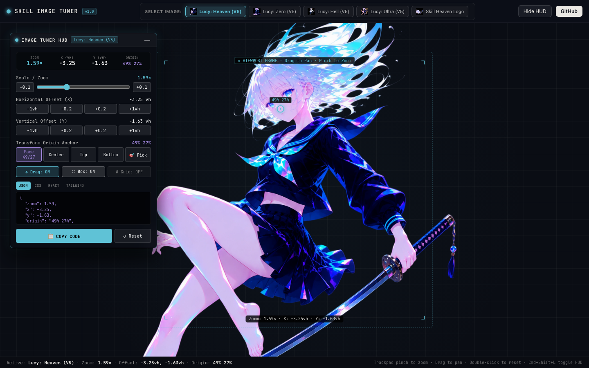
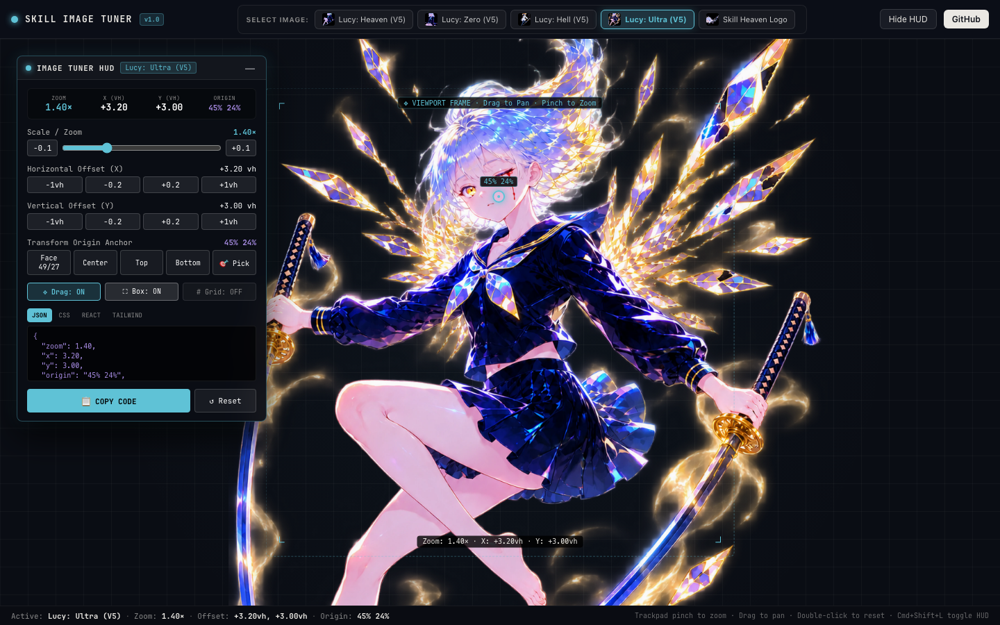
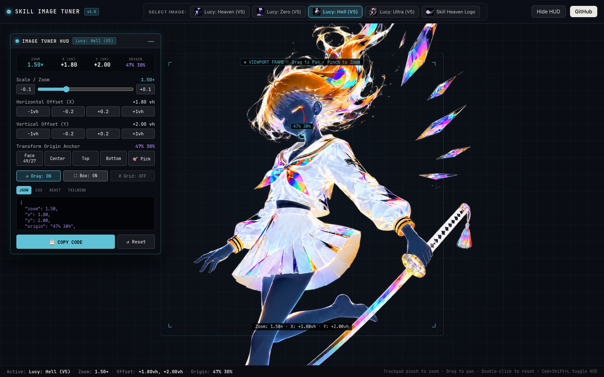
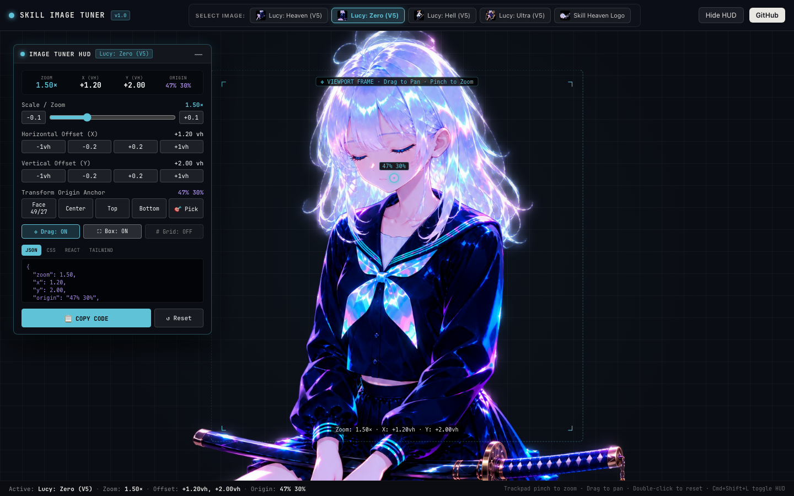
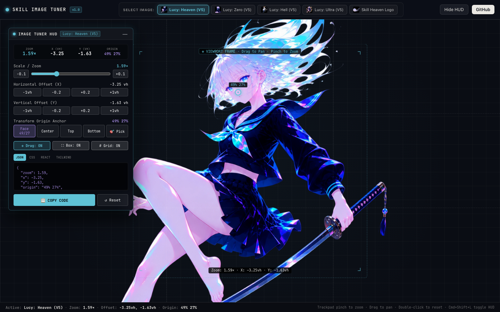

# Skill Image Tuner

> **Universal interactive image positioning, scaling, and framing tuner HUD**  
> Born from the Lucy hero framing system at [Skill Heaven](https://skill-heaven.dev).

[](LICENSE)
[](https://www.typescriptlang.org/)
[](https://react.dev/)
[](https://vite.dev/)

---



`skill-image-tuner` is an interactive dev-tool HUD and standalone visual staging harness for positioning, scaling, anchoring, and framing images with sub-pixel precision. It turns trial-and-error CSS adjustments into a fluid, visual, drag-and-pinch canvas.

Originally built to frame the flagship **Lucy v5** delivery assets (`Zero · Heaven · Hell · Ultra`) for the Skill Heaven website, `skill-image-tuner` generalizes those mechanics so you can frame **any image** and instantly copy production-ready CSS, React styles, JSON configurations, or Tailwind classes.

---

## 📸 Showcase: Framing Lucy Across Motifs

### Lucy: Heaven (V5) · Convergent Cyan
*Face-anchored framing at `49% 27%`, `zoom: 1.59×`, `x: -3.25vh`, `y: -1.63vh`*


---

### Lucy: Ultra (V5) · Entropy Apex
*Twin-blade halo framing at `45% 24%`, `zoom: 1.40×`, `x: +3.20vh`, `y: +3.00vh`*



---

### Lucy: Hell (V5) · Exploratory Crimson
*Katana framing at `47% 30%`, `zoom: 1.50×`, `x: +1.80vh`, `y: +2.00vh`*



---

### Lucy: Zero (V5) · Katana Floor
*Monochrome floor framing at `47% 30%`, `zoom: 1.50×`, `x: +1.20vh`, `y: +2.00vh`*



---

### Rule-of-Thirds Grid Overlay
*Activate `# Grid: ON` to align facial features, eyes, and action lines with compositional guides:*



---

## ✨ Features

- **✥ Interactive Drag to Pan**: Click and drag directly on the canvas to offset X and Y with live `vh` / pixel readouts.
- **🔍 Trackpad Pinch-to-Zoom**: Native desktop trackpad pinch gesture zoom (via `ctrlKey` wheel event filtering) that scales the image around its configured transform origin.
- **🎯 Visual Transform Origin Picker**: Click anywhere on the image to pin the exact CSS `transform-origin` (e.g. anchoring directly to Lucy's eye/face at `49% 27%`).
- **🎛️ Floating Draggable HUD**: A collapsible, translucent glass HUD window that can be moved anywhere on screen without blocking your canvas view.
- **📐 Viewfinder & Composition Guides**: Toggleable dashed bounding box with corner brackets, live coordinate chips, and a rule-of-thirds grid.
- **🖼️ Universal Image Selector**:
  - Built-in presets: Lucy Heaven, Lucy Zero, Lucy Hell, Lucy Ultra, and Skill Heaven Logo.
  - **Upload Local Files**: Drag and drop or browse any PNG, WebP, JPG, or SVG from your machine.
  - **Load from Web URL**: Paste any public image link to tune immediately.
- **📋 Multi-Format Export**: One-click code generation for:
  - **JSON Config**: `{ zoom: 1.59, x: -3.25, y: -1.63, origin: "49% 27%" }`
  - **CSS**: `transform-origin: 49% 27%; transform: translate(...) scale(1.59);`
  - **React Inline Style**: `style={{ transformOrigin: '49% 27%', transform: ... }}`
  - **Tailwind Utility Classes**: Arbitrary value classes for zero-runtime styling.

---

## 🚀 Quick Start

### 1. Clone and Run

```bash
git clone https://github.com/gaia-research/skill-image-tuner.git
cd skill-image-tuner
npm install
npm run dev
```

Open [http://localhost:5188](http://localhost:5188) in your browser.

### 2. URL Parameters

Jump directly into specific presets and view modes:

- `?image=lucy-heaven` — Open Lucy Heaven preset
- `?image=lucy-ultra` — Open Lucy Ultra preset
- `?image=lucy-hell` — Open Lucy Hell preset
- `?image=lucy-zero` — Open Lucy Zero preset
- `?grid=1` — Enable rule-of-thirds composition grid by default
- `?hud=0` — Hide HUD on load (clean view mode)

---

## ⌨️ Controls & Shortcuts

| Action | Shortcut / Gesture |
| :--- | :--- |
| **Pan Image** | Click & drag on canvas |
| **Zoom Image** | Trackpad pinch gesture (or Zoom slider) |
| **Set Transform Origin** | Click `🎯 Pick` in HUD, then click on the target feature |
| **Toggle HUD** | `Cmd + Shift + L` (Mac) / `Ctrl + Shift + L` (Win) |
| **Toggle Viewfinder** | Press `V` |
| **Reset Framing** | Double-click canvas or click `↺ Reset` |

---

## 🛠️ Reusable Component Architecture

The codebase is modular and can be integrated into any React application:

```tsx
import { ImageCanvas } from './components/ImageCanvas'
import { TunerHUD } from './components/TunerHUD'
import { ImageSelector } from './components/ImageSelector'

// Pass any image object and receive live transform updates:
<ImageCanvas
  image={{ src: '/my-character.png', name: 'Hero Character' }}
  config={config}
  onChangeConfig={setConfig}
  showViewfinder={true}
  showGrid={false}
  dragMode={true}
  isSettingOrigin={false}
/>
```

---

## 📜 License

MIT © [Gaia Research](https://github.com/gaia-research)
